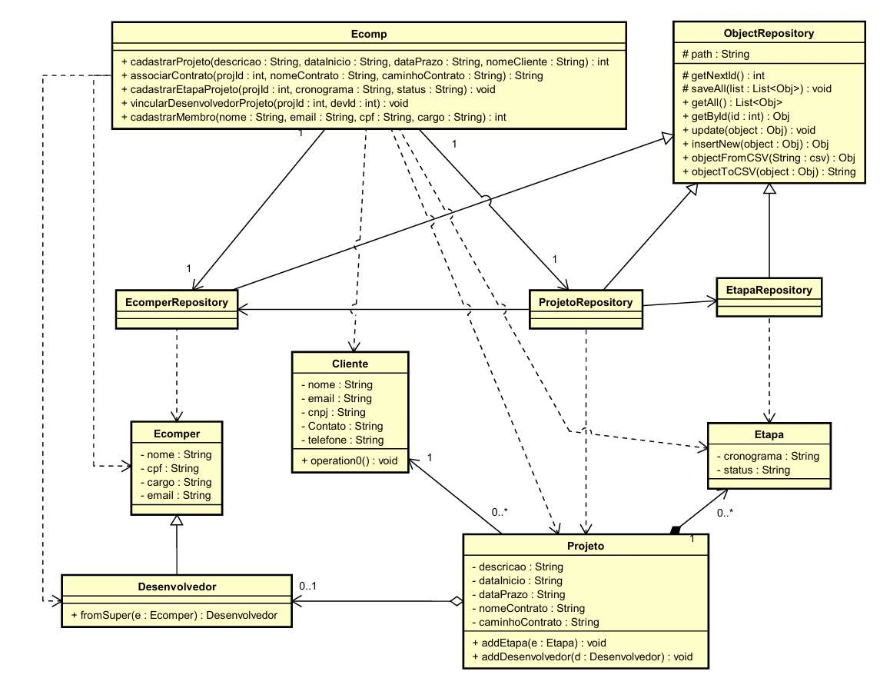

# Ecomp Management System

A Java-based domain management system designed to demonstrate Software Engineering Design Patterns, object-oriented principles (OOP), and CSV-based data persistence.

The application manages organizational workflow entities including members (Ecomper), developers (Desenvolvedor), projects (Projetos), milestones (Etapas) and clients (Cliente).

---

## 🏛 Architecture & Design Patterns

This project applies several classical GoF (Gang of Four) Design Patterns and architectural principles:

### 1. Facade Pattern

- **Class:** `Ecomp`
- **Role:** Acts as a unified high-level interface concealing the internal complexity of multiple repositories (`EcomperRepository`, `ProjetoRepository`) and domain entities (`Projeto`, `Ecomper`, `Etapa`). Clients interact exclusively with `Ecomp` to execute complex workflows such as registering members, creating projects, binding contracts, and assigning developers.

### 2. Repository / Data Access Object (DAO) Pattern

- **Classes:** `ObjectRepository` (Abstract Base), `EcomperRepository`, `ProjetoRepository`, `EtapaRepository`
- **Role:** Encapsulates data persistence logic. `ObjectRepository` defines standard generic CRUD operations (`getAll`, `getById`, `insertNew`, `update`) and CSV serialization methods (`objectToCSV`, `objectFromCSV`), decoupling storage mechanics from domain logic.

### 3. Template Method & Inheritance

- **Classes:** `ObjectRepository` $\rightarrow$ `EcomperRepository`, `ProjetoRepository`, `EtapaRepository`
- **Role:** Base repository classes establish common workflows for file IO and identifier generation (`getNextId`), which concrete implementations reuse or adapt for specific domain objects.

### 4. Converter / Factory Method Strategy

- **Class:** `Desenvolvedor`
- **Role:** The `fromSuper(e: Ecomper)` method converts generic organizational members into specialized `Desenvolvedor` roles while preserving base state attributes.

---

## Class Diagram

### Visual Diagram

